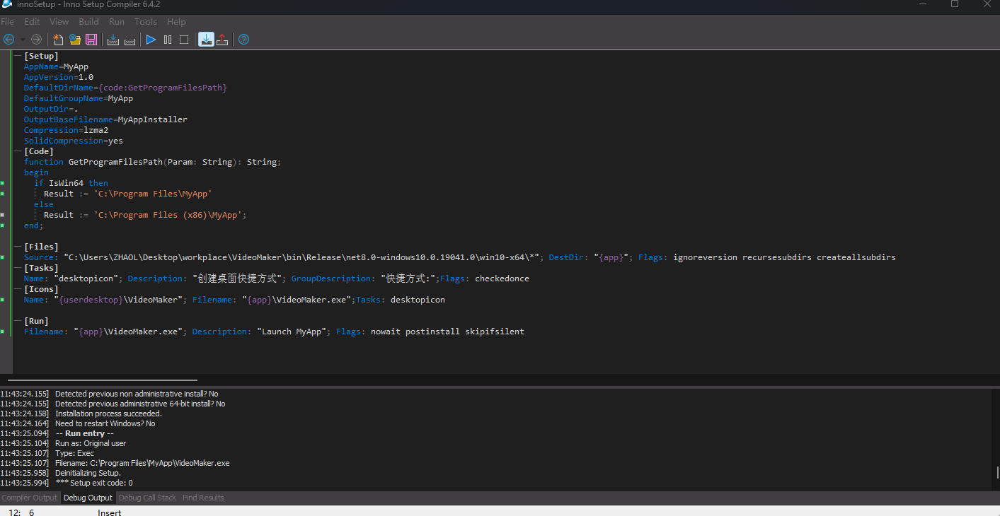

 ```bash
 <WindowsPackageType>None</WindowsPackageType>
  dotnet publish -c Release -f net8.0-windows10.0.19041.0 -r win-x64    /p:PublishSingleFile=true
  ```

  
  dotnet publish -c Release -f net8.0-windows10.0.19041.0 -r win-x64    /p:PublishSingleFile=false  -o ./publish
  
  innosetup构建SetUp.exe
  